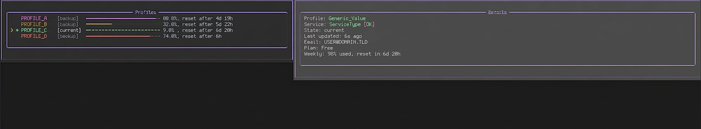

# codex-switch

CLI for switching Codex accounts from the terminal.



### Features

- **Account Snapshotting**: Automatically detects new Codex accounts and prompts to save them into `~/.codex/myaccounts/snapshots/`.
- **Seamless Switching**: Quickly switch among multiple saved profiles via an interactive terminal interface.
- **Usage Monitoring**: Displays real-time account details, including 7-day usage limits.
- **Lightweight Design**: Stores minimal UI and cache data in `~/.codex/myaccounts/codex_switch_cache.json`.

### Prerequisites

- [uv](https://github.com/astral-sh/uv) (recommended).
- Python 3.10 or higher.

### Installation

Clone the repository first:

```bash
git clone <repository-url>
cd codex-switch
uv tool install .
```


#### Development

If you are working on `codex-switch` itself and want to run the test suite, install the dev group:

```bash
uv sync --group dev
uv run pytest
```

This keeps `pytest` and `pytest-cov` out of the runtime install while still making them available for local testing.

### Usage

1. **Login**: Log in to your Codex account through the standard method.
2. **Capture**: Run `codex-switch`. The tool will detect the new account and ask you to save it.
3. **Switch**: Use the TUI to select and activate any saved profile.

```bash
codex-switch
```

### Controls

| Key | Action |
| :--- | :--- |
| `j` / `k` or `Down` / `Up` | Move selection |
| `Tab` | Loop through profiles |
| `Enter` | Save current unsaved profile or switch to selected profile |
| `n` | Rename the selected profile |
| `d` / `Delete` | Delete the selected profile |
| `u` | Manually refresh usage info |
| `q` | Quit |

*Note: Usage information (e.g., 7-day limit) auto-refreshes every 5 minutes while the app is running.*
